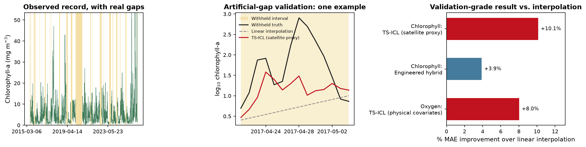

# Reconstructing gaps in coastal sensor records

I developed this project during my internship at CEAZA (Center of Advanced Studies in Arid Regions, June–August 2026), under the supervision of Dr. Orlando Astudillo. I worked
with chlorophyll-a and dissolved-oxygen records from the Tongoy Balsa buoy in
Chile, asking how much of a missing coastal time series can be reconstructed
from the observations around the gap and from external ocean–atmosphere data.



## The problem

Coastal in-situ sensors go offline: biofouling, maintenance, transmission
failures. The record ends up full of holes, some a day long, some spanning
months. I wanted a defensible answer to "what probably happened during that
gap".

The approach is diagnostic reconstruction (imputation). 

## What I worked on

- Built the daily chlorophyll and dissolved-oxygen targets from CEAZAMet's
  hourly in-situ data, with an explicit eligibility rule and QC.
- Designed an **artificial-gap validation** protocol: hide real, known
  values, run every candidate method as if they were missing, score the
  predictions against the values that were secretly retained. This is the
  only evidence in the repository that supports ranking methods — real
  (naturally occurring) gaps have no withheld truth to check against.
- Benchmarked a model ladder for both targets: climatology/persistence/
  interpolation baselines, external-predictor tabular models, a Gaussian
  process and a state-space model, and **TS-ICL**, a zero-shot time-series
  foundation model, evaluated with and without external covariates.
- Applied validated methods to the real gaps in the chlorophyll record,
  publishing two independent, method-specific candidate reconstructions.
- Wrote up both case studies in a report, two presentations, and a poster.

## Main findings

- Linear interpolation is a genuinely strong baseline, especially at short
  gap lengths — beating it is not automatic.
- External-predictor tabular models (calendar, meteorology, satellite
  proxies, no target-sensor history) did not consistently beat
  interpolation, for either target.
- TS-ICL, conditioned on the right covariate, gave the strongest pooled
  result for both case studies: **+10.1%** MAE improvement over
  interpolation for chlorophyll (satellite chlorophyll proxy covariate,
  CI excludes zero) and **+8.0%** for oxygen (physical-covariate arm — SST,
  wind, solar, currents — the first comparator to beat interpolation on
  oxygen at all, 95% CI [4.5%, 11.4%]).
- Covariate effects were selective: some
  covariate configurations hurt performance. A negative-control experiment
  supported that temporal alignment and covariate information mattered
- Every method under predicts high-chlorophyll event days, and TS-ICL's
  oxygen improvement does not hold uniformly across the distribution (it
  loses to interpolation in both distribution tails). Neither limitation is solved.
- Real-gap outputs remain **candidates**: there is no withheld ground truth
  for a naturally occurring gap, so no real-gap number is presented as
  validated accuracy.

See `docs/evidence_and_limitations.md` for the full evidence hierarchy and
known limitations before citing any number from this repository.

## Explore the project

| | |
|---|---|
| Report (PDF) | [`manuscript/report/coastal_gap_reconstruction_report.pdf`](manuscript/report/coastal_gap_reconstruction_report.pdf) |
| English presentation (PDF) | [`manuscript/presentation/coastal_gap_reconstruction_presentation_en.pdf`](manuscript/presentation/coastal_gap_reconstruction_presentation_en.pdf) |
| Presentación en español (PDF) | [`manuscript/presentation_colleagues_es/coastal_gap_reconstruction_presentation_es.pdf`](manuscript/presentation_colleagues_es/coastal_gap_reconstruction_presentation_es.pdf) |
| Poster (PDF) | [`manuscript/poster/coastal_gap_reconstruction_poster.pdf`](manuscript/poster/coastal_gap_reconstruction_poster.pdf) |
| Six notebooks | [`notebooks/`](notebooks/) — start at [`01_data_and_gap_audit.ipynb`](notebooks/01_data_and_gap_audit.ipynb) |
| Live, visual demo (real TS-ICL run) | [`demo/gap_reconstruction_walkthrough.ipynb`](demo/gap_reconstruction_walkthrough.ipynb) |
| Chlorophyll / oxygen experiment code | [`experiments/chlorophyll/`](experiments/chlorophyll/), [`experiments/oxygen/`](experiments/oxygen/) |
| Public data and results | [`data/`](data/), [`results/`](results/) |

## Running the code

```bash
git clone https://github.com/matteofaverio/coastal-gap-reconstruction
cd coastal-gap-reconstruction
uv sync --extra notebooks --extra test --locked
uv run pytest tests/
uv run jupyter lab notebooks/01_data_and_gap_audit.ipynb
```

Most of this repository — every notebook except one, the whole test suite,
every result table — needs no TS-ICL or torch install. TS-ICL lives in its
own separately locked environment (`environments/tsicl/`, used by
`notebooks/04_tsicl_and_covariates.ipynb` and the demo); expensive full-grid
reproduction is documented but optional. See `docs/reproducibility.md` for
the three levels (quick / standard / expensive) and exact commands.
Automated tests and CI (`.github/workflows/ci.yml`) cover the core package,
notebooks, and document builds.

## Evidence and limitations

Read `docs/evidence_and_limitations.md` before treating any number in this
repository as more certain than it is. Short version: artificial-gap
results are validated; real-gap outputs are plausible candidates only; the
longest real gap (256 days) is explicitly out of the validated range.
`docs/methods.md` covers how each method works, and `docs/data_dictionary.md`
documents every column in `data/` and `results/`.

## Acknowledgements and references

This work was carried out during my applied-mathematics internship at CEAZA
(Centro de Estudios Avanzados en Zonas Áridas, June–August 2026), under the
supervision of Dr. Orlando Astudillo. Thanks to CEAZA/CEAZAMet for the
monitoring data and the scientific context that made this possible.

TS-ICL: Etienne Le Naour, Tahar Nabil, Adrien Petralia, "TS-ICL: A Flexible
Time-Indexed Foundation Model for Time Series via In-Context Learning,"
2026 ([EDF-Lab/ts-icl](https://github.com/EDF-Lab/ts-icl)). TS-ICL is
governed by its own separate non-commercial license, not this repository's
MIT license — see `docs/reproducibility.md`.

## License and data

- [`LICENSE`](LICENSE) — MIT, applies to code.
- [`docs/data_sources.md`](docs/data_sources.md) — data, results, and
  figures are not MIT licensed; required attribution for CEAZAMet/CEAZA,
  NASA/PO.DAAC MUR SST, and Copernicus Marine Service.
